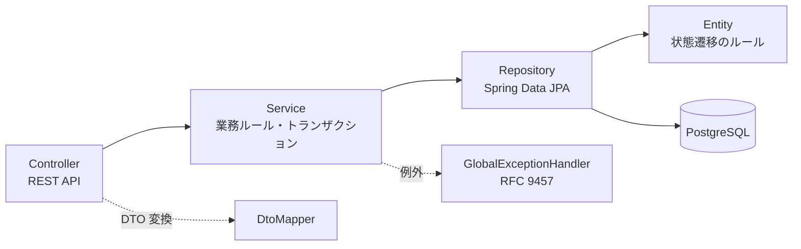
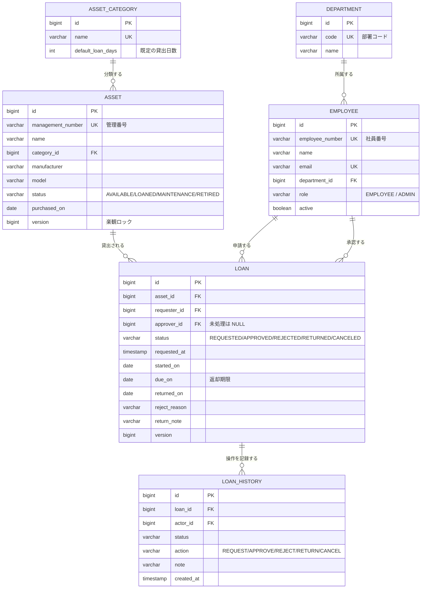
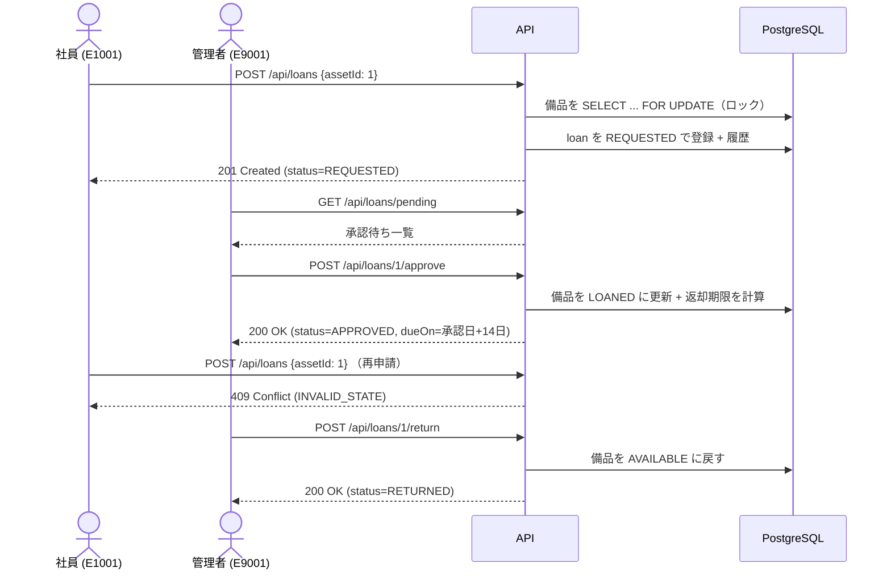

# java-asset-loan-system

Java / Spring Boot で作った**社内備品の貸出管理システム**です。
「PC を借りたい」「承認したい」「返却した」という日常的な業務を、
**状態遷移のルールと権限チェックを壊さずに** REST API として実装しています。

- 単純な CRUD ではなく、**業務ルール（貸出中の備品は貸せない／承認は管理者のみ／期限管理）** を実装
- Controller / Service / Repository / Entity / DTO を分離し、**例外とトランザクション**を明示的に扱う
- テストは **37 件**（ユニット・結合・API）が `./mvnw test` で完走（Docker 不要）

---

## 概要

| 項目 | 内容 |
|---|---|
| 何をするか | 社内の備品（PC・モニター・タブレット・プロジェクター等）の登録・検索・貸出申請・承認・返却を管理する |
| 利用者 | 社員（検索・申請・自分の貸出確認）と管理者（マスタ管理・承認・却下・返却処理・延滞確認） |
| 技術 | Java 21 / Spring Boot 3.5 / Spring MVC / Spring Data JPA / PostgreSQL / Flyway / Maven / JUnit 5 / Docker |
| API | REST（`/api/assets` `/api/loans` `/api/employees` など）。エラーは RFC 9457 Problem Details 形式 |
| テスト | 37 件（ユニット 21 / 結合・API 16）。H2（PostgreSQL 互換モード）で Docker なしで実行可能 |

## 開発背景

業務系システムの開発では、**「画面を作る」より「業務ルールを壊さない」ほうが難しい**と考えています。
備品貸出は一見単純ですが、実際に運用すると次のような事故が起きます。

1. **二重貸出**: 同じ PC に 2 人が同時に申請して、両方承認されてしまう
2. **不正な状態遷移**: 返却済みの申請をもう一度返却する、却下した申請を承認する
3. **権限の抜け**: 一般社員が承認できてしまう
4. **履歴が残らない**: 「誰がいつ承認したか」が分からず、トラブル時に追えない
5. **削除してはいけないデータの削除**: 貸出履歴のある備品を消してしまい、過去の記録が壊れる

そこで、**「どの状態からどの状態へ遷移できるか」をエンティティに閉じ込め、
権限チェックをサービス層で必ず行い、すべての操作を履歴テーブルに追記する**設計にしました。
この 5 つの事故を、それぞれテストで再現して防いでいることがこのプロジェクトの中心です。

## 主な機能

**社員向け**

- 備品の検索（管理番号・名称・メーカー・型番の部分一致、カテゴリ・状態での絞り込み、ページング）
- 備品の詳細確認（現在貸出中の相手と返却期限が分かる）
- 貸出申請 / 申請の取消（承認前のみ。自分の申請だけ）
- 自分の貸出一覧・現在借りている備品・操作履歴

**管理者向け**

- 備品の登録・編集・削除（貸出中は編集不可、履歴がある備品は削除せず「廃棄」へ）
- 備品の状態変更（修理・点検・廃棄）
- 部署・カテゴリ・社員の管理
- 承認待ち一覧 / 承認（返却期限を自動計算）/ 却下（理由必須）/ 返却処理
- 延滞一覧（返却期限を過ぎた貸出）/ 在庫状況の集計

## 使用技術

| 分類 | 技術 | 選んだ理由 |
|---|---|---|
| 言語 | Java 21 | LTS。`record`（DTO）と `switch` 式（例外→HTTP ステータスの分岐）を使いたかった |
| FW | Spring Boot 3.5 | Spring MVC + JPA + Validation を最小構成でまとめられる |
| DB | PostgreSQL 16 | 業務系で最も一般的。`GENERATED BY DEFAULT AS IDENTITY` など標準 SQL で書ける |
| マイグレーション | Flyway | スキーマを**コードとしてレビュー**できる。`ddl-auto=validate` で実装とのズレを起動時に検出 |
| ビルド | Maven（Wrapper 同梱） | `./mvnw` だけで同じバージョンが動く。設定が宣言的で読みやすい |
| テスト | JUnit 5 + Mockito + AssertJ / MockMvc | ユニット・API を通しで書ける |
| コンテナ | Docker / Docker Compose | DB とアプリをまとめて起動できる |

**意図的に入れていないもの**

- **Lombok**: 新卒の面接でコードを読んでもらう前提なので、`getter` も明示的に書いています（何が起きているか一目で分かる）。
- **MapStruct などの自動マッピング**: 変換箇所が少なく、`DtoMapper` 1 クラスで十分読めるため。
- **過剰なデザインパターン**: 抽象化レイヤを増やさず、Controller → Service → Repository の 3 層に留めています。

## Architecture



- **Controller**: HTTP の入出力だけ。業務判断はしない
- **Service**: トランザクション境界と権限チェック。**ここが業務ルールの入口**
- **Entity**: 「貸出中は貸せない」といった**状態遷移そのもの**をメソッドで表現（不正なら例外）
- **DTO**: エンティティを直接返さない（遅延ロードの罠と「DB 構造＝API 仕様」を避ける）

## データベース設計（ER 図）



設計上のポイント:

| 判断 | 理由 |
|---|---|
| 備品は**個体単位**（型番単位ではない） | 「この 1 台だけ貸出中」を正確に判定するため。型番単位だと在庫数の引き当てが必要になり複雑になる |
| 貸出状態を `asset.status` と `loan.status` の**両方**で持つ | 検索時に「貸出可能な備品」を JOIN なしで絞りたい。両者の整合性はサービス層の 1 トランザクションで保証する |
| 履歴は `loan_history` に**追記のみ** | 「今の状態」は `loan.status` が持つが、監査のために「いつ誰が何をしたか」を残す。更新・削除しない |
| 備品の削除は**論理削除**（`RETIRED`） | 貸出履歴から参照されるため。物理削除は「履歴が 1 件もない備品」だけに許可 |
| `version` 列（楽観ロック） | 同時更新の検出。二重貸出の防止は悲観ロック（`SELECT ... FOR UPDATE`）で行う |

## ディレクトリ構成

```
java-asset-loan-system/
├── src/main/java/com/example/assetloan/
│   ├── AssetLoanApplication.java
│   ├── domain/          # エンティティと状態遷移のルール
│   ├── repository/      # Spring Data JPA（検索条件・ロック）
│   ├── service/         # 業務ルールとトランザクション
│   ├── dto/             # リクエスト/レスポンスと変換
│   ├── web/             # Controller・例外ハンドラ・操作者の解決
│   └── config/          # Clock・Security・MVC 設定
├── src/main/resources/
│   ├── application.properties / application-local.properties
│   └── db/migration/    # Flyway（V1: スキーマ、V2: 初期管理者）
├── src/test/java/       # ユニット・結合・API テスト
├── scripts/             # 起動・初期データ投入・デモ実行
├── docs/                # デモの実行ログ
├── Dockerfile / docker-compose.yml
└── pom.xml / mvnw
```

## セットアップ

### 1. Docker Compose（推奨・PostgreSQL で動かす）

```bash
git clone https://github.com/shiyuanyeming-hub/java-asset-loan-system.git
cd java-asset-loan-system
docker compose up -d db          # PostgreSQL を起動
./mvnw spring-boot:run           # アプリを起動（Flyway がスキーマを適用）
./scripts/seed-demo-data.sh      # デモ用の初期データを投入
```

まとめて起動する場合:

```bash
docker compose up --build        # アプリもコンテナで起動（http://localhost:8080）
```

### 2. Docker なし（H2 で試す）

```bash
./scripts/run-local.sh           # H2（PostgreSQL 互換モード）+ ファイル保存で起動
./scripts/seed-demo-data.sh
```

### 前提

- Java 21（`./mvnw` が Maven 本体を自動で用意します）
- Docker を使う場合は Docker Desktop

## 使用方法

操作者は `X-Employee-Number` ヘッダで指定します（デモ用の簡易認証。詳細は「技術的に工夫した点」参照）。

### 備品を検索する

```console
$ curl -s "http://localhost:8080/api/assets?keyword=PC&size=5" \
    -H 'X-Employee-Number: E1001' | python3 -m json.tool
{
  "items": [
    {
      "id": 1,
      "managementNumber": "PC-0001",
      "name": "ThinkPad X1 Carbon",
      "categoryName": "ノートPC",
      "manufacturer": "Lenovo",
      "model": "21HM",
      "status": "AVAILABLE",
      "lendable": true,
      "dueOn": null
    },
    { "...": "PC-0002 MacBook Pro 14 も同様" }
  ],
  "page": 0,
  "size": 5,
  "totalElements": 2,
  "totalPages": 1
}
```

### 貸出申請 → 承認 → 返却（一連の流れ）

`./scripts/demo-loan-flow.sh` を実行すると、以下の流れが**実際に**実行され
`docs/demo-output/loan-flow.txt` に記録されます（README に載せている出力はこのログからの引用です）。



**① 貸出申請（社員）**

```console
$ curl -X POST http://localhost:8080/api/loans \
    -H 'Content-Type: application/json' -H 'X-Employee-Number: E1001' \
    -d '{"assetId": 1}'
HTTP 201
{
  "id": 1,
  "status": "REQUESTED",
  "statusLabel": "申請中",
  "assetId": 1,
  "managementNumber": "PC-0001",
  "assetName": "ThinkPad X1 Carbon",
  "requesterEmployeeNumber": "E1001",
  "requestedAt": "2026-10-04T02:26:36.254848",
  "dueOn": null,
  "overdue": false
}
```

> 申請の時点では備品の状態は `AVAILABLE` のまま（承認されて初めて `LOANED` になります）。

**② 承認（管理者）**

```console
$ curl -X POST http://localhost:8080/api/loans/1/approve \
    -H 'X-Employee-Number: E9001'
HTTP 200
{
  "id": 1,
  "status": "APPROVED",
  "statusLabel": "貸出中",
  "approverName": "管理者 太郎",
  "startedOn": "2026-10-04",
  "dueOn": "2026-10-18",     ← カテゴリの既定日数（ノートPC = 14日）から自動計算
  "overdue": false
}
```

**③ 一般社員が承認しようとすると 403**

```console
$ curl -X POST http://localhost:8080/api/loans/1/approve -H 'X-Employee-Number: E1001'
HTTP 403
{
  "type": "about:blank",
  "title": "Forbidden",
  "status": 403,
  "detail": "管理者のみ実行できます（実行者: 社員 E1001 / 権限: EMPLOYEE）",
  "instance": "/api/loans/1/approve",
  "code": "FORBIDDEN_OPERATION"
}
```

**④ 貸出中の備品に再申請すると 409（二重貸出の防止）**

```console
$ curl -X POST http://localhost:8080/api/loans \
    -H 'Content-Type: application/json' -H 'X-Employee-Number: E1001' -d '{"assetId": 1}'
HTTP 409
{
  "type": "about:blank",
  "title": "Conflict",
  "status": 409,
  "detail": "この備品は現在貸し出せません（状態: LOANED）",
  "instance": "/api/loans",
  "code": "INVALID_STATE"
}
```

**⑤ 返却（管理者）**

```console
$ curl -X POST http://localhost:8080/api/loans/1/return \
    -H 'Content-Type: application/json' -H 'X-Employee-Number: E9001' \
    -d '{"note": "キズなし"}'
HTTP 200
{ "id": 1, "status": "RETURNED", "statusLabel": "返却済み", "returnedOn": "2026-10-04", "returnNote": "キズなし" }
```

**⑥ 履歴が残る（申請 → 承認 → 返却）**

```console
$ curl -s http://localhost:8080/api/loans/1/history -H 'X-Employee-Number: E1001'
[
  {"id": 1, "action": "REQUEST", "status": "REQUESTED", "actorName": "社員 E1001",     "createdAt": "2026-10-04T02:26:36.256"},
  {"id": 2, "action": "APPROVE", "status": "APPROVED",  "actorName": "管理者 太郎",   "note": "返却期限: 2026-10-18", "createdAt": "2026-10-04T02:26:36.306"},
  {"id": 3, "action": "RETURN",  "status": "RETURNED",  "actorName": "管理者 太郎",   "note": "キズなし", "createdAt": "2026-10-04T02:26:36.354"}
]
```

**⑦ 返却後は貸出可能に戻る（備品の再利用）**

```console
$ curl -s http://localhost:8080/api/assets/1 -H 'X-Employee-Number: E1001'
{ "id": 1, "managementNumber": "PC-0001", "status": "AVAILABLE", "lendable": true, "currentLoan": null }
```

### 主な API 一覧

| メソッド | パス | 権限 | 説明 |
|---|---|---|---|
| GET | `/api/assets` | 全員 | 備品検索（keyword / category / status / page / size） |
| GET | `/api/assets/{id}` | 全員 | 備品詳細（現在の貸出状況つき） |
| GET | `/api/assets/stats` | 全員 | 状態別の件数と延滞件数 |
| POST | `/api/assets` | 管理者 | 備品の登録 |
| PUT | `/api/assets/{id}` | 管理者 | 備品の更新（貸出中は不可） |
| PATCH | `/api/assets/{id}/status` | 管理者 | 状態変更（修理・廃棄など） |
| DELETE | `/api/assets/{id}` | 管理者 | 削除（貸出履歴がある場合は不可） |
| POST | `/api/loans` | 社員 | 貸出申請 |
| GET | `/api/loans/my` | 社員 | 自分の貸出一覧 |
| GET | `/api/loans/my/active` | 社員 | 現在借りている備品 |
| GET | `/api/loans/{id}/history` | 本人・管理者 | 操作履歴 |
| GET | `/api/loans/pending` | 管理者 | 承認待ち一覧 |
| GET | `/api/loans/overdue` | 管理者 | 延滞一覧 |
| POST | `/api/loans/{id}/approve` | 管理者 | 承認 |
| POST | `/api/loans/{id}/reject` | 管理者 | 却下（理由必須） |
| POST | `/api/loans/{id}/return` | 管理者 | 返却 |
| POST | `/api/loans/{id}/cancel` | 申請者本人 | 取消（承認前のみ） |
| GET | `/api/departments` `/api/categories` | 全員 | マスタ参照（申請フォーム用） |
| GET/POST | `/api/employees` | 管理者 | 社員の参照・登録 |

エラーは **RFC 9457（Problem Details）** 形式で返します。`code` を見れば分岐できます。

| HTTP | code | 発生例 |
|---|---|---|
| 400 | `VALIDATION_ERROR` | 必須項目の欠落（`errors` に項目別メッセージ） |
| 403 | `FORBIDDEN_OPERATION` | 一般社員が承認しようとした |
| 404 | `RESOURCE_NOT_FOUND` | 存在しない備品 ID |
| 409 | `INVALID_STATE` | 貸出中の備品に申請、返却済みを再返却 |
| 409 | `DUPLICATE_REQUEST` | 管理番号・社員番号の重複、二重申請 |
| 409 | `CONCURRENT_UPDATE` | 同時更新の衝突（楽観ロック） |

## テスト

```console
$ ./mvnw test
[INFO] Running com.example.assetloan.service.LoanServiceTest
[INFO] Tests run: 10, Failures: 0, Errors: 0, Skipped: 0
[INFO] Running com.example.assetloan.domain.LoanTest
[INFO] Tests run: 11, Failures: 0, Errors: 0, Skipped: 0
[INFO] Running com.example.assetloan.LoanWorkflowIT
[INFO] Tests run: 8, Failures: 0, Errors: 0, Skipped: 0
[INFO] Running com.example.assetloan.web.LoanApiIT
[INFO] Tests run: 8, Failures: 0, Errors: 0, Skipped: 0
[INFO] Results:
[INFO] Tests run: 37, Failures: 0, Errors: 0, Skipped: 0
[INFO] BUILD SUCCESS
```

テストは 3 層に分けています。

| 種別 | クラス | 何を確認するか |
|---|---|---|
| ドメイン（ユニット） | `LoanTest` | 状態遷移のルール（承認・却下・返却・取消、不正遷移、延滞判定） |
| サービス（ユニット） | `LoanServiceTest` | 権限チェック、重複申請、期限計算、**API のエラー仕様**（Mockito でリポジトリを差し替え） |
| 結合 | `LoanWorkflowIT` | 実 DB での一連の流れ、**同時申請 10 件で成功が 1 件だけ**、延滞一覧、削除制約 |
| API | `LoanApiIT` | HTTP リクエスト→レスポンス（MockMvc）、ステータスコード、エラー形式、バリデーション |

Docker がなくても `./mvnw test` が完走するように、テストは **H2（PostgreSQL 互換モード）** で実行し、
**本番と同じ Flyway のマイグレーション**を適用して `ddl-auto=validate` で検証しています。
（`src/test/resources/application-test.properties`）

## 技術的に工夫した点

### 1. 状態遷移のルールをエンティティに閉じ込めた

`Loan.approve()` / `reject()` / `returnAsset()` / `cancel()` は、
**許可されない状態からの呼び出しで例外**を投げます。

```java
public void returnAsset(LocalDate returnedOn, String note) {
    requireStatus(LoanStatus.APPROVED, "返却");   // ← 返却中以外は例外
    this.returnedOn = returnedOn;
    this.asset.markAvailable();
    this.status = LoanStatus.RETURNED;
}
```

サービス層は「どのメソッドを呼ぶか」だけを判断すればよくなり、
「返却済みをもう一度返却する」といったバグが構造的に起きにくくなります。

### 2. 二重貸出を DB のロックで防いでいる

「申請が来たら重複をチェックして登録」という素朴な実装は、**同時実行で壊れます**。
2 つのリクエストが同時にチェックを通過して、両方登録されてしまうためです。

対策として、申請時に**備品の行を悲観ロック**してから確認します。

```java
Asset asset = assetRepository.findByIdForUpdate(assetId)   // SELECT ... FOR UPDATE
        .orElseThrow(...);
if (!asset.isLendable()) { throw new InvalidStateException(...); }
if (!loanRepository.findActiveByAssetId(assetId, HOLDING).isEmpty()) { throw new DuplicateRequestException(...); }
```

これを **10 スレッドで同時に叩くテスト**で検証しています（成功が 1 件、残りは 409）。

### 3. 操作者をヘッダで受け取り、権限チェックはサービス層に集約

デモでは SSO を持たないため、`X-Employee-Number` ヘッダで操作者を解決します
（`@CurrentEmployee` アノテーション + `HandlerMethodArgumentResolver`）。

- 権限チェックは**サービス層で必ず実施**するので、ヘッダを偽装しても管理者操作は実行できない
- 本番では OIDC に置き換える想定で、**置き換え箇所が 2 クラスに閉じている**のが狙い
- 未登録の社員番号が来た場合は自動登録します（最初の管理者を誰が作るかという鶏卵問題を避けるため）。
  初期管理者 `E9001` は Flyway の `V2__seed_admin.sql` で投入しています

### 4. 「消してはいけないデータ」を消させない

貸出履歴のある備品を物理削除すると、過去の記録が壊れます。
そのため削除 API は**履歴がある場合に 409 を返し**、代わりに状態を `RETIRED`（廃棄）にするよう案内します。

### 5. N+1 と遅延ロードを設計で潰した

`spring.jpa.open-in-view=false`（推奨設定）にしているため、
レスポンス生成時に遅延ロードすると `LazyInitializationException` になります。
これを**エンティティグラフ**で明示的に解決しました。

```java
@EntityGraph(attributePaths = {"asset", "asset.category", "requester", "approver"})
Optional<Loan> findById(Long id);
```

「どの関連を一緒に読むか」をリポジトリの宣言で見えるようにしています。

### 6. 本番の DB とテストの DB の違いを、違いとして扱う

テストは H2 ですが、**悲観ロックの SQL が DB ごとに違います**
（PostgreSQL 方言は `FOR NO KEY UPDATE`、H2 は解釈できない）。
設定で H2 方言を明示し、**その理由を設定ファイルにコメントで残しました**。
「テストが通るから本番も大丈夫」とは言わず、差分を明示する方針です。

## 開発中に発生した課題と解決方法

実際にこの開発で詰まった点を残します。

### 1. H2 が `FOR NO KEY UPDATE` を解釈できず、結合テストが全滅

- **症状**: `LoanWorkflowIT` の 8 件すべてが
  `Syntax error in SQL statement "... for [*]no key update"` で失敗。
- **原因**: `spring.jpa.properties.hibernate.dialect` に **PostgreSQL 方言**を指定していたため、
  悲観ロックが PostgreSQL 固有の `FOR NO KEY UPDATE` に変換され、H2 が解釈できなかった。
- **対処**: テストプロファイルでは H2 方言を使うよう変更（`org.hibernate.dialect.H2Dialect`）。
  あわせて H2 の `LOCK_TIMEOUT` を 10 秒に延ばし、同時実行テストがロック待ちで落ちないようにしました。
  設定ファイルに「なぜ H2 方言なのか」をコメントとして残しています。

### 2. レスポンス生成時に `LazyInitializationException`

- **症状**: 貸出一覧 API と備品検索 API が
  `Could not initialize proxy [AssetCategory#7] - no session` で 500 エラー。
- **原因**: `open-in-view=false` にしていたため、Service のトランザクションを抜けた後に
  DTO 変換で `asset.getCategory().getName()` を触って遅延ロードが発生していた。
- **対処**: `@EntityGraph` で関連を先読み（`asset`, `asset.category`, `requester`, `approver`）。
  「レスポンスで使う関連はリポジトリで宣言する」というルールにしました。

### 3. 管理者が存在せず、何も登録できない（鶏卵問題）

- **症状**: 初期データ投入スクリプトが全部 404。エラーは「社員番号 E9001 の社員が見つかりません」。
- **原因**: 「管理者が備品を登録する」API なのに、その管理者を登録する API も管理者権限が必要だった。
- **対処**: ①`X-Employee-Number` の社員が未登録なら自動登録する（サービス層の権限チェックは維持）、
  ②初期管理者 `E9001` は Flyway の `V2__seed_admin.sql` で投入する、の 2 段構えにしました。

### 4. テストが `*IT` を実行してくれない

- **症状**: `./mvnw test` でユニットテスト 21 件しか走らず、結合テストが無視されていた。
- **原因**: Maven Surefire の既定の対象は `*Test` / `*Tests` / `*TestCase` で、`*IT` は含まれない。
- **対処**: `pom.xml` の Surefire に `<includes>` を追加して `**/*IT.java` も実行するようにしました。
  「テストを書いたのに実行されていない」は最も危険な状態なので、件数を必ず確認するようにしています。

### 5. 備品を消したら履歴が壊れる

- **症状**: 結合テストで、過去に貸し出した備品を削除できてしまい、
  `loan_history` から参照できないデータが発生しそうになった。
- **対処**: 削除 API に「貸出履歴があれば 409 を返す」ルールを追加し、
  状態を `RETIRED` にする運用へ誘導。テスト（`cannotDeleteAssetWithHistory`）で固定しました。

## Limitations

- **認証を実装していません**。`X-Employee-Number` ヘッダで操作者を決める**デモ用の割り切り**です。
  ヘッダを偽装すれば他人として操作できます（権限チェックは効くので管理者操作はできません）。
  実運用では SSO（OIDC）に置き換える必要があります。
- **返却期限の通知がありません**（メール・Slack 連携なし）。延滞一覧 API までは実装済みです。
- **在庫の「予約」はできません**。「来週の月曜から借りたい」という将来の予約は未対応で、
  申請は常に即時申請として扱われます。
- **同時実行のテストは H2 上での結果**です。PostgreSQL 実機での検証は Docker 環境が必要です
  （`docker compose up -d db` + `SPRING_PROFILES_ACTIVE=` で実行できます）。
- 備品の画像・添付ファイル、監査ログの外部出力、通知、バッチ（延滞の自動検出）は未実装です。

## Future Work

- Spring Security + OIDC による認証・認可（`CurrentEmployeeResolver` の置き換え）
- 将来日付の予約と、貸出期間の重複チェック（`Loan` に期間を持たせて排他制約を入れる）
- 延滞の自動検出バッチと通知（メール / Slack）
- **Testcontainers による PostgreSQL での結合テスト**（ロックの挙動を本番と同じ条件で検証）
- 楽観ロック衝突時の自動リトライ
- ページング・検索の性能検証（インデックスの効果測定）
- OpenAPI（springdoc）による API ドキュメント自動生成

## ライセンス

MIT（`LICENSE` 参照）
